# DLC 脚本使用文档

[English Version](README.md)

本目录包含用于在阿里云深度学习容器服务 (Deep Learning Containers, DLC) 或基于 Kubernetes 的环境中提交和管理渲染作业的实用脚本。

## 1. 核心工作流与架构 (Workflow & Architecture)

在 DLC 上运行任务通常涉及两个环境：
1.  **提交环境 (DSW/Local)**: 您的开发机器（如 DSW 实例或本地电脑）。您在这里编写代码并**提交**任务。
2.  **执行环境 (DLC Cluster)**: 阿里云的计算集群。任务被提交后，会在这里启动新的容器（Worker）来**执行**渲染。

**调用链路图:**

```mermaid
graph LR
    A[DSW/本地终端] -- 1. python submit_batch.py --> B(dlc submit 命令)
    B -- 2. 提交任务描述 (JSON/YAML) --> C[阿里云 DLC 集群]
    C -- 3. 调度并启动 Worker 容器 --> D[Worker 节点]
    D -- 4. 挂载代码 & 数据 --> E(运行 launch_job.sh)
    E -- 5. 配置系统环境 --> F(运行 run_task.sh)
    F -- 6. 激活 Conda & 运行 Python --> G[render_usd.cli]
```



---

## 2. 脚本详解 (Scripts Details)

### 2.1 `submit_batch.py` (任务分发器)
*   **运行位置**: DSW 或 本地开发机。
*   **职责**: 自动化批量提交。它是一个 Python 脚本，用于循环生成多个分块任务，并调用 `dlc` 命令行工具将它们一一提交到集群。
*   **核心逻辑**:
    ```python
    # 伪代码
    for chunk_id in range(total_chunks):
        cmd = "bash launch_job.sh ..." # 构造启动命令
        subprocess.run(f"dlc submit ... --command '{cmd}'") # 调用阿里云 CLI
    ```
*   **用法**:
    ```bash
    python scripts/dlc/submit_batch.py --total 30 --name grscenes_render
    ```

### 2.2 `launch_job.sh` (容器入口点)
*   **运行位置**: DLC 集群的 Worker 容器内（任务启动时执行的第一个脚本）。
*   **职责**:
    1.  **环境初始化**: 设置 `PYTHONPATH`，导出必要的环境变量（如 `WORKSPACE_ID`）。
    2.  **对接 DLC 参数**: 接收从 `dlc submit` 传进来的参数（如 `CHUNK_ID`）。
    3.  **启动任务**: 调用 `run_task.sh`。
*   **用法**: 通常由 `submit_batch.py` 自动调用，不建议手动直接运行（除非为了调试）。

### 2.3 `run_task.sh` (任务执行器)
*   **运行位置**: DLC 集群的 Worker 容器内。
*   **职责**:
    1.  **环境激活**: 自动检测并激活项目目录下的 Miniconda 环境 (`render-usd`)，确保 Python 依赖正确。
    2.  **依赖安装**: 如果发现包未安装，会自动执行 `pip install -e .`。
    3.  **执行渲染**: 最终调用核心 Python 渲染命令 (`python -m render_usd.cli`)。
*   **用法**:
    ```bash
    # 单机调试/运行
    bash scripts/dlc/run_task.sh 0 100
    ```

---

## 3. DSW 环境配置与提交流程 (DSW Setup Guide)

如果您在 DSW 中执行提交脚本时遇到“命令未找到”或“鉴权失败”错误，请检查以下配置。

### 3.1 为什么需要配置？
DSW 只是一个开发环境。要将任务发送到 DLC 集群，需要使用阿里云提供的客户端工具 —— **`dlc` CLI**。
1.  **工具依赖**: 您的 DSW 环境必须安装了 `dlc` 命令行工具。
2.  **身份认证**: 工具必须知道“你是谁”（AccessKey），才有权限代表您提交任务。

### 3.2 检查与配置步骤

**步骤 1: 检查是否安装 `dlc` 工具**
在终端运行：
```bash
which dlc
# 如果没有输出，说明未安装或未添加到 PATH
```
*如果未安装*，通常需要安装阿里云 PAI-DLC 的 SDK 或 CLI 包（具体请参考阿里云 PAI 文档，通常预置镜像中已包含）。

**步骤 2: 配置账号凭证 (Critical)**
即使安装了工具，首次使用前必须配置您的阿里云 AccessKey。
```bash
dlc config
```
系统会提示您输入：
*   **AccessKey ID**: 您的阿里云访问密钥 ID。
*   **AccessKey Secret**: 您的阿里云访问密钥 Secret。
*   **Endpoint**: DLC 服务的接入点（如 `dlc.cn-beijing.aliyuncs.com`）。
*   **Region**: 地域（如 `cn-beijing`）。

**步骤 3: 验证**
配置完成后，尝试列出当前的任务：
```bash
dlc get jobs
```
如果能列出任务列表，说明环境配置成功，可以运行 `submit_batch.py` 了。

---

## 4. 本地测试 (Local Testing)

在提交到 DLC 之前，您可以在本地运行脚本以验证环境和渲染逻辑。

**渲染单个文件:**
```bash
bash scripts/dlc/run_task.sh single /path/to/asset.usd [output_dir]
```

**运行批量分块 (试运行):**
```bash
# 处理 100 个分块中的第 0 个 (将扫描资产但在本地机器上运行)
bash scripts/dlc/run_task.sh 0 100
```

**原位渲染 (In-place Rendering):**
如果希望将渲染图像保存在与 USD 文件相同的目录中（而不是单独的输出文件夹），请使用 "inplace" 作为保存目录参数：
```bash
bash scripts/dlc/run_task.sh 0 1 "/path/to/assets" "inplace"
```

---

## 5. DLC 环境变量配置

您可以在运行 `submit_batch.py` 之前通过设置环境变量来自定义作业提交。**务必**根据您的 DLC 环境验证这些值。

*   `DLC_WORKSPACE_ID`: 您的 DLC 工作空间 ID (默认: `270969`)。
*   `DLC_RESOURCE_ID`: 资源配额 ID (默认: `quotalplclkpgjgv`)。
*   `DLC_IMAGE`: Docker 镜像地址 (默认: `pj4090acr-registry-vpc.cn-beijing.cr.aliyuncs.com/pj4090/yangsizhe:isaacsim41-cuda118`)。
*   `DLC_CODE_ROOT`: 代码在容器内的挂载路径 (默认: `/cpfs/shared/simulation/zhuzihou/dev/render-usd`)。

### 数据源 (Data Sources)
`launch_job.sh` 脚本默认使用特定的数据源 ID：`d-phhmdh73h3zzv7pqh0,d-r70bzlwqnstu3rg55l,d-d49o5g0h2818sw8j1g,d-8wz4emfs21s5ajs9oz`。
请确保这些 ID 对应您实际需要挂载的数据集，或者作为第 4 个参数传递给 `launch_job.sh`。
